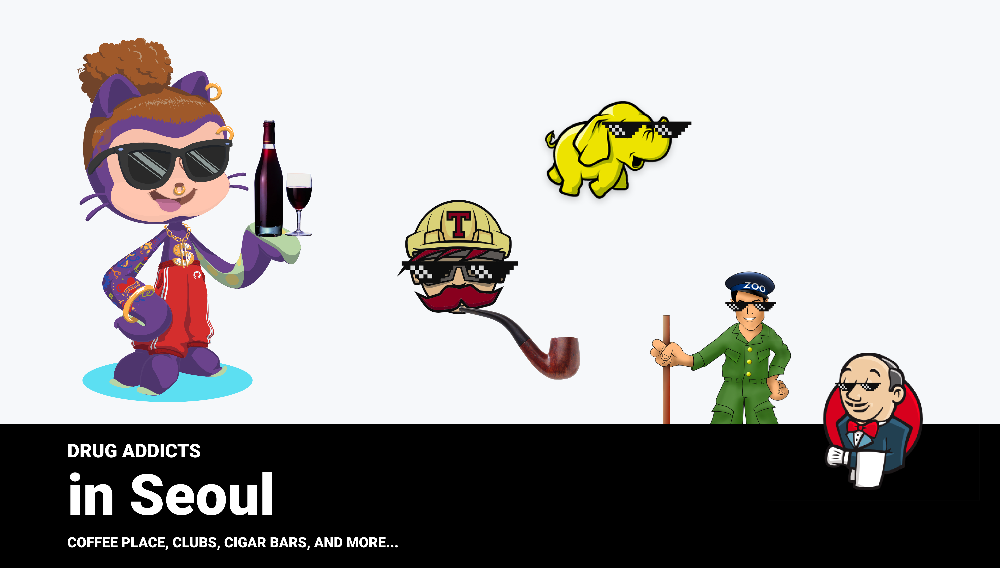
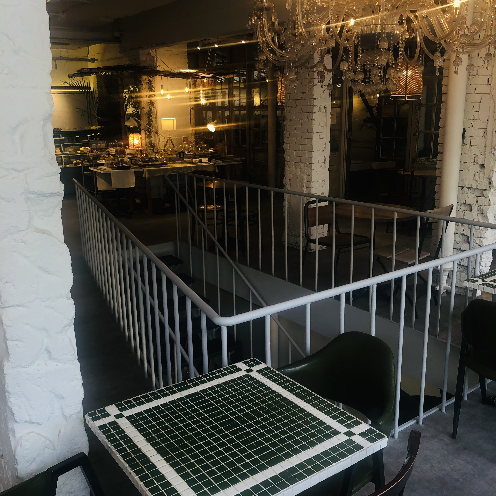

# drug ☕️🚬🐈👩‍💻  addicts   




`MAX_SCORE = 12.0`

```yml
name: name of the cafe
magic: name of the best menu
geek_score: overall score for geeks
outlet_rate: score based on number of outlets
supports_puff: boolean yes/no value for cafe having built-in smoking area
has_roof: boolean for cafe having the roof-top
cat: category of 'this'
floors: floor range of the cafe
best_for: e.g. "thinking of ex."
```

## Seoul, Korea
**gangnam**


*신논현 까치화방*
> 🌹 + ☕️ = ❤️
```yml
magic: 차이티 Chai tea
geek_score: 7/12
outlet_rate: 2/12
supports_puff: false
has_roof: false
cat: 
  - ☕️
  - 🌹
  - lo-fi
floors: 1
best_for: listening to lo-fi
```


---------


*신논현 정월*

> 🌕 + 🍵 = 🚪
```yml
magic: Milk tea
geek_score: 9/12
outlet_rate: 6/12
supports_puff: false
has_roof: true
cat: 
  - 🌕
  - 🎋
  - calming
floors: B1 - 2
best_for: writing / reading a book
```


--------

*ab cafe (Create, It's your world.)*

> 🍓 + 🌴 = 🌅

```yaml
magic: Strawberry latte
geek_score: 10/12
outlet_rate: 11/12
supports_puff: false
has_roof: false
cat: 
  - 🌺
  - 🌴
  - ğŸ
  - hawaii
floors: B1 - 2
best_for: writing / laying down, thinking stuff
```


*something about coffee*

> 💡 + 🍞 = 💀

```yaml
magic: Vanilla pound
geek_score: 10/12
outlet_rate: 7/12 (outlets are available, but only for corner seets)
supports_puff: false
has_roof: true
cat: 
  - ğŸ
  - ☕️
  - 🎧
  - modern
floors: B1 - 2
best_for: watching clouds in the sky
```




